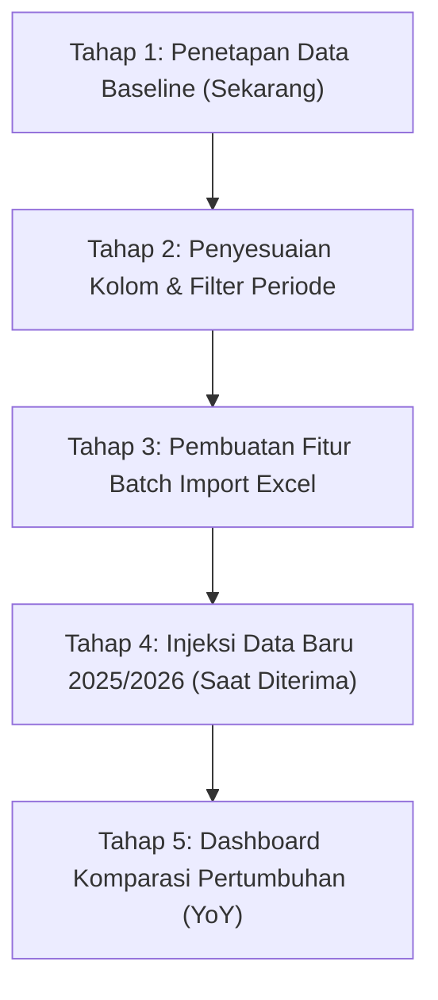

# 📊 Rencana & Tahapan Tata Kelola Data Pelaku UMKM
## APLI DAKOP v2.0 — Dinas Koperasi & UKM Kabupaten Konawe Selatan

> [!NOTE]
> **Konteks Situasi Saat Ini**:
> Berdasarkan hasil konsultasi dengan Dinas Koperasi dan UMKM, basis data sebanyak **17.671 Pelaku UMKM** yang ada saat ini merupakan **data awal yang telah difinalisasi/dikunci (Periode 2021–2024)**. Pembaruan data untuk tahun **2025/2026** sedang dalam proses pengumpulan dan permintaan ke dinas terkait.

---

### 1. Prinsip Utama Pengelolaan Data

1. **Jadikan Kekuatan, Bukan Kelemahan**:
   - Di mata juri dan penilai inovasi pemerintah daerah, memiliki **17.671 data riil** yang telah diverifikasi dan dikunci adalah aset besar bernama **Data Baseline (Tahun Dasar / T-0)**.
   - Hal ini membuktikan bahwa aplikasi tidak menggunakan *dummy data* (data palsu), melainkan bersumber dari pendataan resmi skala kabupaten.

2. **Perlindungan Data Historis (*Locked Baseline Protection*)**:
   - Data 2021–2024 dikunci dari aksi hapus massal atau edit sembarangan agar rekam jejak historis tetap utuh dan dapat diaudit (*audit trail*).

3. **Kesiapan Menampung Data Baru (*Forward Compatibility*)**:
   - Sistem disiapkan agar ketika file data tahun 2025/2026 tiba dari dinas, data tersebut dapat langsung diunggah (*batch import*) ke sistem dan otomatis dikelompokkan ke tahun pendataan yang sesuai.

---

### 2. Roadmap & Tahapan Eksekusi

#### Tahap 1: Penetapan & Penguncian Data Baseline (Status: SELESAI / BERJALAN)
- **Tindakan**:
  - Menandai 17.671 data yang ada sebagai `status_data = 'BASELINE'` atau `tahun_pendataan = 2024`.
  - Memberi badge transparan di antarmuka web:
    - *"Status Data: Baseline Resmi Dinas Koperasi & UKM (2021–2024)"*.
- **Tujuan**:
  - Pengguna publik dan tim juri mengetahui bahwa data ini adalah data resmi yang sudah diaudit.

#### Tahap 2: Penyesuaian Backend & Filter Periode di Frontend
- **Tindakan Database**:
  - Menambahkan kolom `tahun_pendataan` (tipe `INT` atau `VARCHAR(4)`) pada tabel `master_pelaku`.
  - Mengisi (*backfill*) nilai `2024` (atau sesuai tahun berdiri masing-masing) untuk seluruh data eksisting.
- **Tindakan Frontend**:
  - Menambahkan dropdown filter **Periode Data** di halaman Pelaku UMKM:
    - `Semua Periode`
    - `Data Baseline (2021 - 2024)`
    - `Tahun 2025` *(akan aktif begitu data diimport)*
    - `Tahun 2026` *(akan aktif begitu data diimport)*
- **Tindakan Proteksi**:
  - Membatasi tombol aksi *Delete* untuk akun non-superadmin pada data berlabel *Baseline*.

#### Tahap 3: Pembuatan Modul Batch Import Excel (Status: SELESAI)
- **Tindakan**:
  - Membuat antarmuka upload file Excel/CSV di dashboard admin beserta parser 18 kolom dinas.
  - Membangun validasi otomatis & logika Upsert di BackendStatistik (`POST /api/v1/master_pelaku/batchImport`) dan Next.js API Route (`/api/pelaku-umkm/import`):
    - Pengecekan NIK unik (jika NIK lama -> update omset/legalitas mutakhir; jika NIK baru -> insert dengan tahun pendataan 2025/2026).
    - Format modal, omset, dan jenis usaha.
  - Menambahkan fitur Export Data ke file Excel/CSV dan Cetak Lembar Rekapitulasi Ber-Kop Dinas Resmi.
- **Tujuan**:
  - Begitu dinas menyerahkan file data 2025/2026, admin tidak perlu input manual satu per satu, cukup upload 1 file Excel/CSV dan ribuan data langsung tersinkronisasi dalam hitungan detik.

#### Tahap 4: Penerimaan & Pemutakhiran Data 2025/2026 (Saat Data Diserahkan)
- **Tindakan**:
  - Impor data baru dengan label `tahun_pendataan = 2025` atau `2026`.
  - Jika pelaku usaha sudah ada di data baseline: opsi untuk *update data* (misal: penambahan omset, kepemilikan NIB baru, sertifikasi Halal).
  - Jika pelaku usaha baru: ditambahkan sebagai *pertumbuhan pelaku baru*.

#### Tahap 5: Penyajian Analitik Komparasi Pertumbuhan (*Growth Analytics*)
- **Tindakan**:
  - Menampilkan grafik komparasi di halaman [Inovasi](file:///Users/simplephi/Documents/riswan/aplidakop_v2/frontend/src/app/%28dashboard%29/inovasi/page.tsx) dan [Dashboard](file:///Users/simplephi/Documents/riswan/aplidakop_v2/frontend/src/app/%28dashboard%29/dashboard/page.tsx):
    - **Pertumbuhan Jumlah UMKM**: Baseline (2024) vs Tahun Berjalan (2025/2026).
    - **Peningkatan Legalitas**: Persentase UMKM yang memiliki NIB/Halal di baseline vs tahun mutakhir.
    - **Peningkatan Omset Rata-Rata Wilayah**.

---

### 3. Keunggulan untuk Presentasi Juri / Penilai Inovasi

| Pertanyaan Penguji Inovasi | Jawaban Strategis Berdasarkan Sistem |
|:---|:---|
| *"Mengapa datanya masih berkisar tahun 2021–2024?"* | *"Data tersebut merupakan **Baseline Data (Tahun Dasar)** hasil audit terpadu Dinas Koperasi & UKM dengan cakupan 17.671 pelaku usaha se-Konawe Selatan. Sistem APLI DAKOP v2.0 telah menyediakan modul pemutakhiran berkala untuk memasukkan data monitoring tahun berjalan (2025/2026) secara terstruktur."* |
| *"Bagaimana membuktikan sistem ini berkelanjutan?"* | *"Sistem dirancang bukan sebagai arsip statis, melainkan memiliki pipa pemutakhiran data (*data pipeline*) melalui import berkala dan pelaporan terpadu kecamatan."* |
| *"Apa tolak ukur keberhasilan inovasi ini?"* | *"Perbandingan terukur antara data baseline (T-0) dengan data tahun berjalan (T-1) dalam hal legalitas usaha, perluasan akses pasar, dan digitalisasi UMKM."* |
