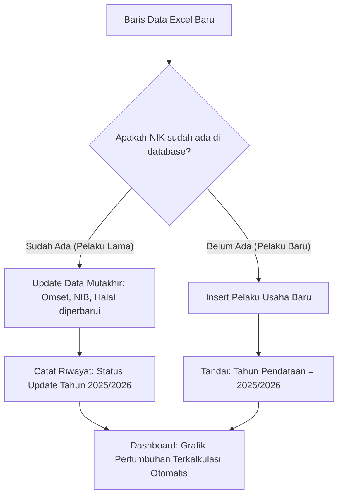

# 📥 Panduan Format & Skema Impor Data Baru (2025/2026)
## Standar Format Pengumpulan Data Dinas Koperasi & UKM

Dokumen ini disusun sebagai panduan teknis yang dapat **langsung dibagikan atau dijadikan acuan bersama staf Dinas Koperasi dan UMKM** ketika menyiapkan file data pemutakhiran tahun **2025 / 2026**.

---

### 1. Struktur Kolom File Excel / CSV yang Dibutuhkan

Saat meminta data terbaru dari dinas, pastikan format lembar kerja (*spreadsheet*) memiliki kolom-kolom berikut:

| No | Nama Kolom Excel | Tipe Data | Contoh Nilai | Keterangan |
|:---:|:---|:---|:---|:---|
| **1** | `NIK` | Teks (16 digit) | `7405032209800002` | Kunci identifikasi unik pelaku usaha |
| **2** | `No KK` | Teks (16 digit) | `7405032507120002` | Nomor Kartu Keluarga |
| **3** | `Nama Pemilik` | Teks | `RICO` | Nama lengkap pemilik usaha |
| **4** | `Nama Usaha` | Teks | `USAHA GORENGAN RICO` | Nama merek / brand usaha |
| **5** | `No HP / WA` | Teks | `085340014457` | Kontak aktif |
| **6** | `Kecamatan` | Teks | `ANDOOLO` | Harus sesuai 25 nama kecamatan resmi |
| **7** | `Desa / Kelurahan` | Teks | `PUUNGGAPU INDAH` | Nama desa / kelurahan |
| **8** | `Jenis Usaha` | Teks | `KULINER` | Kuliner, Perdagangan, Konter, Jasa, Sembako, dll. |
| **9** | `Tahun Berdiri` | Angka | `2025` | Tahun mulai beroperasi |
| **10** | `Modal Sendiri (Rp)` | Angka | `5000000` | Tanpa titik/koma (hanya angka) |
| **11** | `Modal Luar (Rp)` | Angka | `0` | Pinjaman / KUR / Bantuan modal |
| **12** | `Omset Tahunan (Rp)` | Angka | `15000000` | Estimasi pendapatan kotor setahun |
| **13** | `Tenaga Kerja` | Angka | `2` | Jumlah orang yang dipekerjakan |
| **14** | `NIB` | Teks | `090/SKU/180/2025` | Nomor Induk Berusaha (jika ada, atau isi `-`) |
| **15** | `PIRT` | Teks | `-` | Izin P-IRT (jika ada, atau isi `-`) |
| **16** | `Sertifikat Halal` | Teks | `ID7405000123` | Nomor sertifikasi halal (atau isi `-`) |
| **17** | `HAKI` | Teks | `-` | Hak Merek Dagang (atau isi `-`) |
| **18** | `Tahun Pendataan` | Angka | `2025` atau `2026` | Penanda tahun pemutakhiran data |

---

### 2. Aturan Logika Saat Data Baru Diimport ke Sistem

Ketika file Excel diunggah ke APLI DAKOP v2.0, sistem akan menerapkan algoritma pencocokan:

1. **Kasus 1 — Pelaku Usaha Lama yang Berkembang (Update)**:
   - Jika NIK sudah ada di data baseline (2021–2024), data tidak akan digandakan (*no duplicate*).
   - Sistem memperbarui nilai omset, legalitas NIB/Halal yang baru diperoleh, dan mencatatnya sebagai capaian pembinaan.

2. **Kasus 2 — Pelaku Usaha Baru (New Entry)**:
   - Jika NIK belum pernah ada sebelumnya, sistem menambahkan baris baru dengan penanda `tahun_pendataan = 2025` atau `2026`.
   - Ini otomatis menambah angka total populasi UMKM daerah.

---

### 3. Tips Komunikasi Saat Meminta Data ke Dinas

Gunakan draf pesan berikut saat berkoordinasi dengan pejabat atau staf bidang UMKM di dinas:

> *"Yth. Bapak/Ibu Kepala Bidang / Staf Pengelola Data Dinas Koperasi & UMKM Kab. Konawe Selatan,*
>
> *Sehubungan dengan persiapan pengajuan inovasi daerah APLI DAKOP v2.0 pada ajang Smart City (Dimensi Smart Economy), saat ini sistem telah berhasil memetakan dan mengunci seluruh **17.671 data baseline UMKM periode 2021–2024** dari 25 kecamatan.*
>
> *Untuk melengkapi indikator pemutakhiran berkelanjutan dan pertumbuhan usaha tahun berjalan, kami memohon dukungan data monitoring/hasil pendataan terbaru tahun **2025/2026** (meskipun masih berupa data berjalan/parsial). Data dapat diserahkan dalam format Excel standar.*
>
> *Data terbaru ini akan langsung disinkronkan ke sistem sebagai bukti konkret ke dewan juri bahwa tata kelola data UMKM Konawe Selatan terus bertumbuh dan dimutakhirkan secara aktif.*
>
> *Terima kasih atas kerja sama dan dukungannya."*
