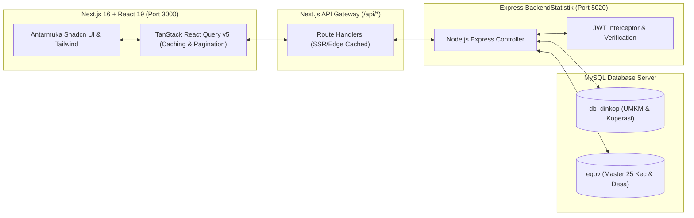

# 📋 Ringkasan Eksekutif Proyek (Executive Project Summary)
## Transformasi Sistem: Dari "Aplidakop-umkm" Menuju Inovasi Digital Smart Economy

> **Catatan Re-branding**: Dokumen ini merangkum profil menyeluruh proyek sistem informasi yang sebelumnya bernama **"Aplidakop-umkm"** (atau **APLI DAKOP UMKM**), yang kini telah berevolusi menjadi arsitektur modern v2.0 dan disiapkan untuk mengikuti ajang **Kompetisi Inovasi Smart City (Dimensi Smart Economy)**.

---

### 1. 💡 Latar Belakang & Identitas Re-Branding

#### A. Identitas Sebelumnya
* **Nama Awal**: `Aplidakop-umkm` / `APLI DAKOP UMKM`
* **Kepanjangan Awal**: Aplikasi Data Koperasi dan UMKM Kabupaten Konawe Selatan.
* **Karakteristik Awal**: Sistem monolitik lama berbasis Vue 2 / Nuxt.js SPA yang difungsikan sebatas pencatatan internal administratif.

#### B. Mengapa Nama Perlu Disesuaikan / Diganti?
1. **Kebutuhan Kompetisi Inovasi Daerah**: Nama inovasi di ajang Smart City membutuhkan identitas yang kuat, berdaya pikat (*catchy*), representatif terhadap dampak ekonomi daerah, dan mudah diingat oleh dewan juri maupun masyarakat.
2. **Perluasan Fungsi**: Sistem saat ini tidak lagi hanya sekadar "buku data statis", melainkan platform analitik spasial sebaran UMKM, pemantauan kesehatan koperasi, pelacakan pembiayaan modal, dan *Single Source of Truth* bagi pimpinan daerah.

#### C. Opsi Usulan Nama Baru (Rekomendasi Re-Branding)

| No | Usulan Nama | Kepanjangan / Filosofi | Nilai Jual untuk Lomba Inovasi |
|:---:|:---|:---|:---|
| **Opsi 1** | **KONSELDIGIKOP** | *Konawe Selatan Digital Koperasi & UMKM* | Kuat mengusung kedaerahan (Konsel) dan penekanan digitalisasi terpadu. |
| **Opsi 2** | **SIKOP-UMKM Konsel** | *Sistem Informasi Terpadu Koperasi & Usaha Mandiri* | Formal, rapi, dan mencerminkan standar sistem informasi kedinasan pemda. |
| **Opsi 3** | **TANGGUH-UMKM** | *Tata Kelola Terpadu & Agregasi Data Usaha Mandiri Hebat* | Menggambarkan ketahanan ekonomi kerakyatan (Smart Economy) pasca pandemi. |
| **Opsi 4** | **SMART-DAKOP** | *Smart Data Koperasi & Pelaku Usaha Konawe Selatan* | Mengaitkan langsung dengan gerakan Smart City dan mempertahankan akar nama lama (Dakop). |
| **Opsi 5** | **APLI DAKOP v2.0 (Modern Edition)** | *Aplikasi Data Koperasi & Pelaku Usaha Terpadu v2.0* | Menjaga kontinuitas nama yang sudah familiar di dinas dengan penegasan versi baru. |

---

### 2. 🎯 Profil & Tujuan Sistem

* **Instansi Pemilik**: Dinas Koperasi dan Usaha Kecil Menengah Kabupaten Konawe Selatan.
* **Pengguna Utama**:
  1. **Operator & Verifikator Dinas**: Pemutakhiran berkala, validasi legalitas usaha (NIB/Halal), monitoring kesehatan koperasi.
  2. **Pimpinan Daerah (Bupati / Kadis / Bappeda)**: Dashboard eksekutif berbasis data spasial untuk perumusan kebijakan subsidi, pelatihan, dan penyaluran permodalan.
  3. **Masyarakat / Pelaku Usaha**: Transparansi direktori usaha dan fasilitasi legalitas.
* **Pilar Smart City**: **Smart Economy (Ekonomi Cerdas)**.

---

### 3. 📊 Skala Data yang Dikelola (Fakta Lapangan)

Sistem ini telah menampung basis data riil skala kabupaten se-Konawe Selatan:

```
┌────────────────────────────────────────────────────────┐
│             APLI DAKOP / DATA GOVERNANCE               │
├──────────────────────────┬─────────────────────────────┤
│ Total Pelaku UMKM        │ 17.671 Pelaku Usaha         │
│ Status Data Saat Ini     │ Baseline Resmi (2021-2024)  │
│ Total Koperasi Terdata   │ 326 Koperasi                │
│ Koperasi Berstatus Aktif │ 248 Koperasi (76.1%)        │
│ Koperasi Tidak Aktif     │ 78 Koperasi (23.9%)         │
│ Cakupan Wilayah          │ 25 Kecamatan, 351 Desa/Kel. │
└──────────────────────────┴─────────────────────────────┘
```

---

### 4. 🚀 Masalah Utama & Solusi yang Dihadirkan

| Kondisi Sebelum Inovasi (*Before*) | Kondisi Setelah Inovasi (*After*) |
|:---|:---|
| **Data Tercecer di File Excel Terpisah**: Setiap seksi dinas menyimpan file Excel sendiri di komputer yang berbeda, rentan hilang atau rusak. | **Single Source of Truth**: Satu basis data terpusat di server pemerintah daerah yang aman dan sinkron. |
| **Pencarian Lambat (1-2 Hari)**: Memerlukan waktu berhari-hari mencari arsip manual pelaku usaha saat ada program bantuan modal atau izin. | **Pencarian Sub-Detik (< 50 ms)**: Pencarian nama, NIK, jenis usaha, kecamatan, dan desa langsung tampil seketika dengan TanStack Query. |
| **Penyaluran Bantuan Rawan Tumpang Tindih**: Sulit memverifikasi apakah penerima sudah pernah menerima bantuan KUR atau modal lain. | **Histori Terintegrasi**: Terhubung dengan modul statistik pembiayaan modal sendiri vs modal luar dan histori permodalan. |
| **Pemantauan Koperasi Pasif**: Tidak diketahui secara pasti mana koperasi yang masih RAT (Rapat Anggota Tahunan) dan mana yang mati suri. | **Monitoring Kesehatan Koperasi Real-Time**: Klasifikasi otomatis status aktif vs tidak aktif berdasarkan legalitas badan hukum. |

---

### 5. 🏗️ Arsitektur Teknologi Terpadu

Sistem ini dibangun dengan arsitektur modern *high-performance*:



* **Frontend**: Next.js 16 App Router, React 19, TypeScript, Tailwind CSS, Shadcn UI, Recharts.
* **Optimasi Data 17k Baris**: Menggunakan **TanStack React Query v5** dengan Server-Side Pagination (`limit: 10`), pencarian debounced 350ms, dan `keepPreviousData` sehingga browser tidak berat dan bebas kedipan (*zero flickering*).
* **Backend API**: REST API berbasis Node.js Express terpusat di `BackendStatistik` (Port 5020).
* **Database**: MySQL dengan connection pool stabil, menghubungkan database operasional dinas (`db_dinkop`) dan master wilayah Kominfo (`egov`).

---

### 6. 📱 Modul & Fitur Unggulan

1. **Dashboard Eksekutif Spasial**:
   - Menampilkan total UMKM, rasio keaktifan koperasi, grafik sebaran per kecamatan, dan sektor usaha dominan (Kuliner, Pertanian, Perdagangan, dll.).
2. **Manajemen Pelaku UMKM dengan 3-Tier Filter**:
   - Filter bertingkat: **[Jenis Usaha]** + **[Kecamatan]** + **[Desa / Kelurahan Dependent]** + Pencarian NIK/Nama Usaha.
3. **Manajemen Koperasi & Kelembagaan**:
   - Rekap nomor badan hukum, pengurus, alamat kantor, status aktif/non-aktif, dan tanggal pengesahan.
4. **Portal Portofolio Inovasi Smart City (`/inovasi`)**:
   - Halaman khusus evaluasi pemenuhan 9 kriteria kompetisi inovasi Smart City, eviden bukti dukung, dokumen regulasi, dan metrik keberhasilan.

---

### 7. 📈 Rencana Lanjutan Tata Kelola Data

1. **Penguncian Data Baseline (Periode 2021–2024)**:
   - Menetapkan 17.671 data sebagai *Tahun Dasar (T-0)* yang diaudit dan dilindungi dari penghapusan tidak sengaja.
2. **Penyediaan Modul Import Batch Excel**:
   - Menyiapkan pintu masuk impor data untuk pemutakhiran tahun berjalan (**2025/2026**).
3. **Analisis Pertumbuhan Year-on-Year (YoY)**:
   - Mengkalkulasi otomatis kenaikan kepemilikan NIB, sertifikasi halal, modal rata-rata, dan serapan tenaga kerja antara data baseline dibanding data mutakhir.
